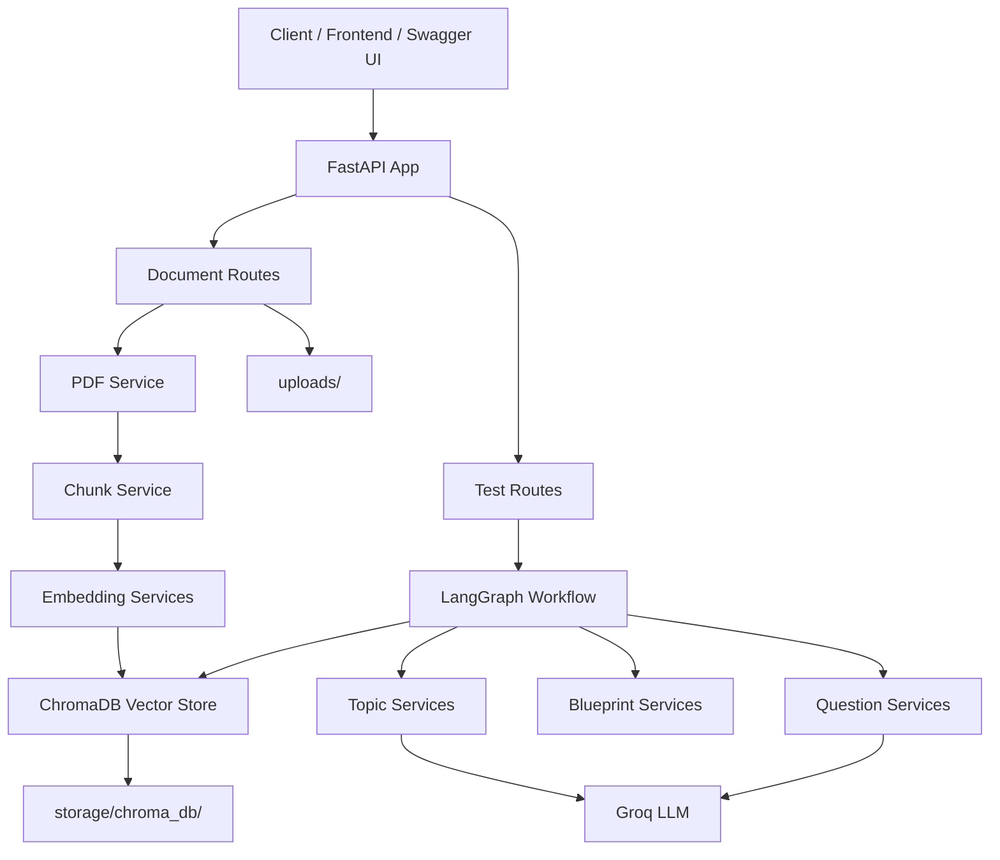
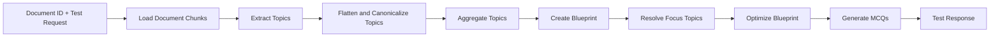
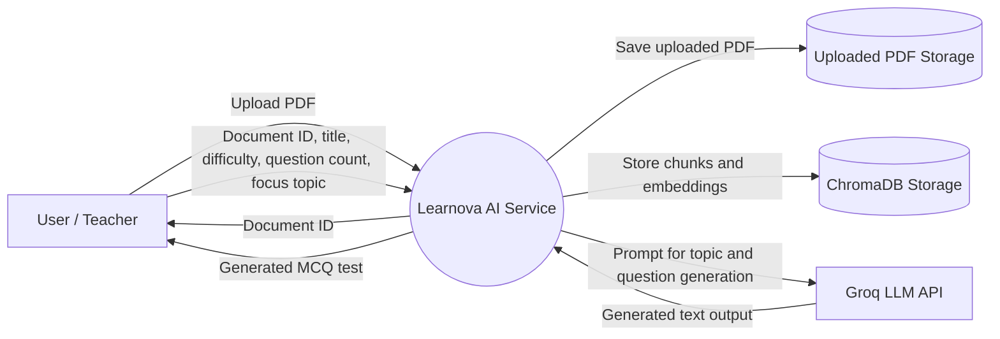
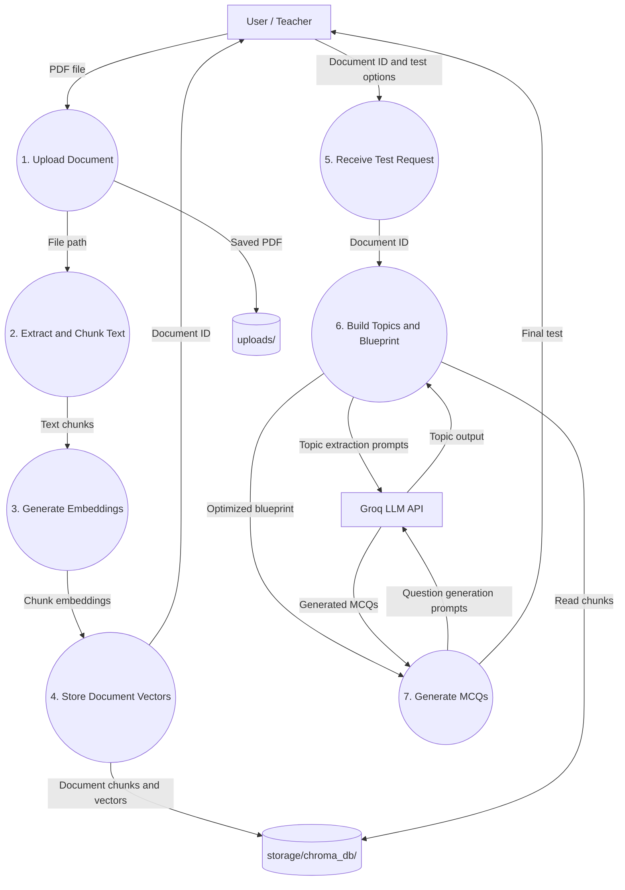

# Learnova AI Service

Learnova AI Service is a FastAPI backend for turning uploaded PDF learning material into generated multiple-choice tests. It extracts PDF text, chunks the content, embeds it with a Hugging Face sentence-transformer model, stores document chunks in ChromaDB, and uses a LangGraph workflow with Groq-backed LLM calls to extract topics, build a question blueprint, and generate MCQs.

## Features

- PDF upload and text extraction with PyMuPDF
- Text chunking with LangChain text splitters
- Local persistent vector storage with ChromaDB
- Embeddings via `sentence-transformers/all-MiniLM-L6-v2`
- Topic extraction and test generation workflow using LangGraph
- MCQ generation through Groq/LangChain
- FastAPI endpoints with interactive Swagger docs

## Project Structure

```text
.
|-- main.py                         # FastAPI application entry point
|-- requirements.txt                # Python dependencies
|-- app/
|   |-- api/                        # HTTP routes
|   |   |-- document_routes.py      # Document upload endpoint
|   |   `-- test_routes.py          # Test generation endpoint
|   |-- config.py                   # Service constants and model settings
|   |-- graph/                      # LangGraph state, nodes, and graph builder
|   |-- models/                     # Request/response models
|   `-- services/                   # Document, embedding, retrieval, topic, LLM, and question services
|-- storage/
|   `-- chroma_db/                  # Persistent ChromaDB data
`-- uploads/                        # Uploaded PDF files
```

## Architecture

The service is organized as a layered FastAPI application. Routes receive HTTP requests, service modules handle document processing, embeddings, retrieval, topic processing, and question generation, and the LangGraph workflow coordinates the test-generation pipeline.



### Generation Workflow



## Data Flow Diagrams

### DFD Level 0

Level 0 shows the whole Learnova AI Service as a single process that receives learning documents and test-generation requests, then returns processed document IDs and generated MCQ tests.



### DFD Level 1

Level 1 breaks the service into its main internal processes: document ingestion, embedding storage, test request handling, topic and blueprint creation, and MCQ generation.



## Requirements

- Python 3.11+
- A Groq API key

## Setup

Create and activate a virtual environment:

```powershell
python -m venv venv
.\venv\Scripts\Activate.ps1
```

Install dependencies:

```powershell
pip install -r requirements.txt
```

Create a `.env` file in the project root:

```env
GROQ_API_KEY=your_groq_api_key_here
```

## Run the API

Start the development server:

```powershell
uvicorn main:app --reload
```

The API will be available at:

```text
http://127.0.0.1:8000
```

Interactive API documentation:

```text
http://127.0.0.1:8000/docs
```

## API Endpoints

### Health Check

```http
GET /
```

Example response:

```json
{
  "status": "running",
  "service": "learnova-ai-service"
}
```

### Upload a Document

```http
POST /documents/upload
```

Upload a PDF file using multipart form data with the field name `file`.

Example with `curl`:

```bash
curl -X POST "http://127.0.0.1:8000/documents/upload" \
  -F "file=@cloud_dummy.pdf"
```

Example response:

```json
{
  "document_id": "generated-document-id",
  "message": "Document processed successfully."
}
```

Keep the returned `document_id`; it is required to generate a test from the uploaded document.

### Generate a Test

```http
POST /tests/generate
```

Example request body:

```json
{
  "document_id": "generated-document-id",
  "question_count": 10,
  "difficulty": "Medium",
  "focus_topic": null,
  "title": "Cloud Computing Basics"
}
```

Example response:

```json
{
  "title": "Cloud Computing Basics",
  "mcqs": []
}
```

The `mcqs` array is populated by the LangGraph generation workflow.

## Configuration

Core settings live in `app/config.py`.

```python
LLM_MODEL = "llama-3.3-70b-versatile"
LLM_TEMPERATURE = 0
EMBEDDING_MODEL = "sentence-transformers/all-MiniLM-L6-v2"
TOP_K_CHUNKS = 2
DEFAULT_DIFFICULTY = "Medium"
```

Adjust these values to change the LLM model, embedding model, retrieval behavior, retry behavior, or generation defaults.

## Data and Storage

- Uploaded files are saved to `uploads/`.
- ChromaDB persists vectors and document chunks in `storage/chroma_db/`.
- Local environment variables should stay in `.env`, which is ignored by Git.

## Development Notes

- The first embedding run may download model files from Hugging Face.
- The LLM workflow requires `GROQ_API_KEY` to be set.
- Use `/docs` while developing to test upload and generation requests from the browser.
